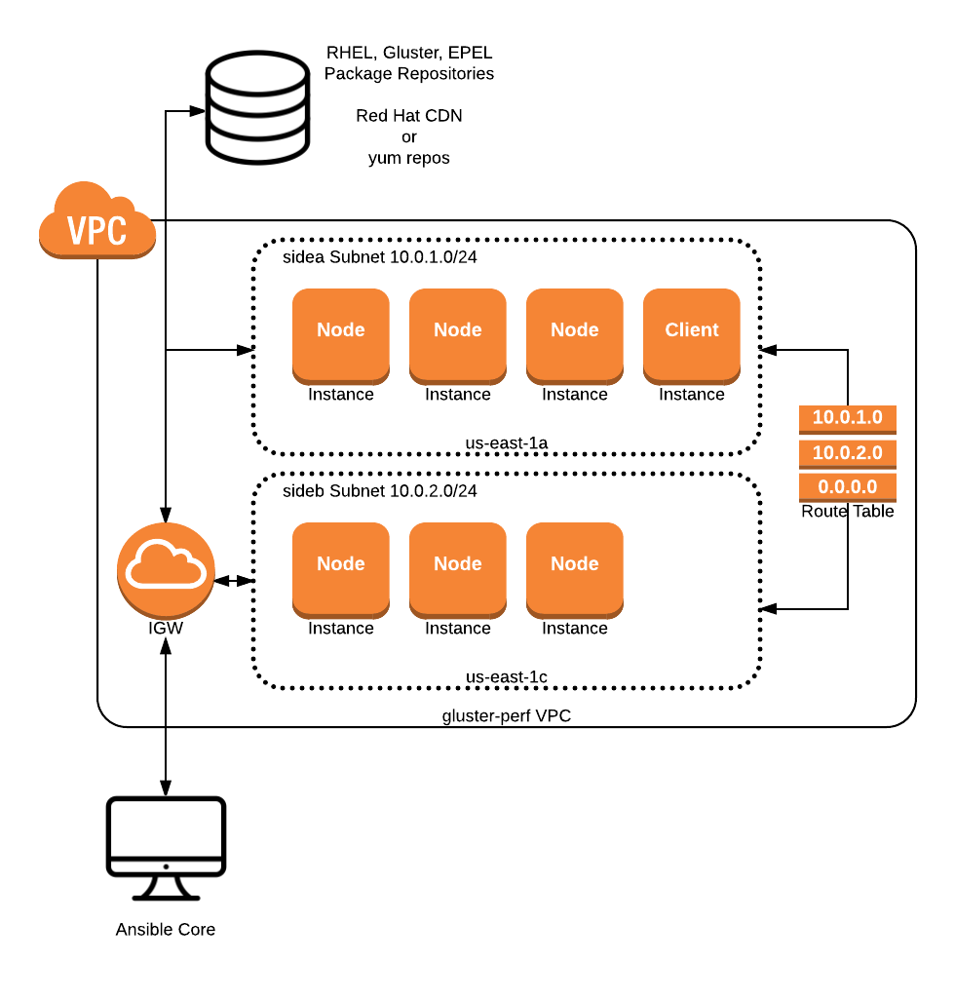
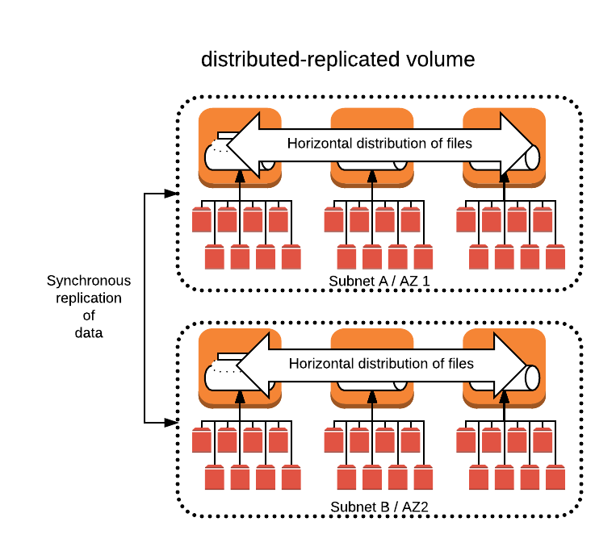

# gluster-perf
Ansible scripts for Red Hat Storage Gluster performance testing

## Overview

This playbook creates a Gluster performance test cluster in AWS. While this 
playbook was designed to be very configurable, the defaqlt settings should
be a good approximation for many production Gluster environments.

Users of this playbook can easily test:
* **distributed-replicated volumes** that span multiple Gluster nodes and
synchronously replicate across availability zones (AZs) for data durability and
availability
* **dispersed volumes** that use [erasure coding](https://access.redhat.com/documentation/en-US/Red_Hat_Storage/3.1/html/Administration_Guide/chap-Red_Hat_Storage_Volumes-Creating_Dispersed_Volumes_1.html) 
to increase data durability and availability

The following metrics are collected for 4KB, 32KB, 256KB, 2MB, 32MB files:
* sequential reads
* sequential writes
* random reads
* random writes

## Default deployment architecture

Unless the defaults in [group_vars/all.yml] are modified, this playbook will 
deploy a Gluster cluster in this architecture:



Each node instance has 8 EBS volumes, which, by default, are allocated as GP2
10 GB volumes.


When deployed as a ```distributed-replicated``` volume, files are horizontally
distributed and synchronously mirrored (replicated) to the other "side."



When deployed as a ```dispersed``` volume using erasure coding, data is 
dispersed among the data nodes, with parity maintained on parity nodes. The
number of parity nodes is configurable, refer to [group_vars/all.yml].


## Running the playbook

In order to use this playbook, you must have administrator access to AWS EC2 
and VPC services.

### Prerequisites

1. [Homebrew](https://brew.sh) (for macOS users)
2. Python 2.7
3. awscli 1.11.44 or later
4. Ansible Core 2.2.1 or later
5. Access to the [Red Hat CDN](https://access.redhat.com) or the following, 
recently updated yum repos:
  * rhel-7-server-rpms
  * rhel-7-server-extras-rpms
  * rhel-7-server-optional-rpms
  * rh-gluster-3-for-rhel-7-server-rpms
  * epel

### Prepairing to run

macOS users can prepare to run this playbook with the following commands.

If Homebrew is already installed, the first two commands can be skipped. Note
that the first command grants administrative users additional rights on the
```/usr/local``` directory, which is preferable to changing ownership from 
root.

```
$ sudo chmod -R +a "admin allow list,add_file,search,delete,add_subdirectory,delete_child,readattr,writeattr,readextattr,writeextattr,readsecurity,writesecurity,chown,file_inherit,directory_inherit" /usr/local
$ /usr/bin/ruby -e "$(curl -fsSL https://raw.githubusercontent.com/Homebrew/install/master/install)"
$ brew install python
$ brew install ansible
$ pip install awscli
```

Linux and macOS users can both use the following configure the AWS CLI with 
the command ```aws configure```.

### Running the playbook

Note that if you are not using the Red Hat CDN, you must invoke 
```ansible-playbook``` with the ```--skip-tags=subscription_manager``` 
argument, and manually configure your nodes with access to the correct yum 
repos.

The ssh key added in the second command below must be the one referenced in 
[group_vars/all.yml] as ```ec2_keypair```.
 
```
$ ssh-agent bash
$ ssh-add /path/to/keypair.pem
$ source env.sh
$ ansible-playbook -i inventory/aws/hosts/ec2.py site.yml
```

## Metrics

Using the default configurations in this playbook, the following metrics were
obtained; reference the associated JSON files.


